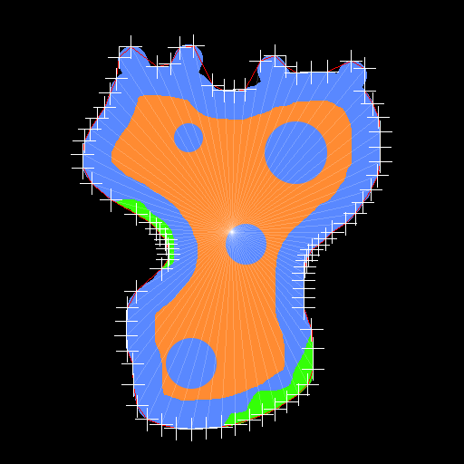

# ConvexHull
Automatic convex hull generation for raster images

This project requires [ccTrigonometry](https://github.com/jobtalle/ccTrigonometry) and [ccVector](https://github.com/jobtalle/ccVector) to build. The test case also requires [ccore](https://github.com/ccore/ccore) to build.

The animated example above shows the three stages of the algorithm with fairly low precision;
- Cropping an inital number of nodes around the image based on precision.
- Mean nodes that are close to each other.
- Perform a Graham scan to obtain a concave shape.
